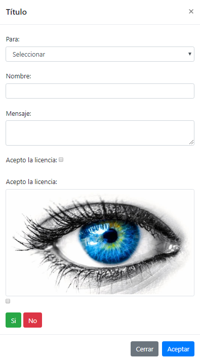
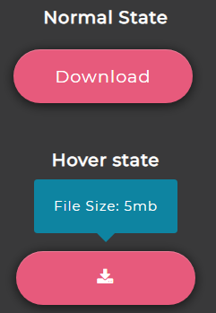

# CSS & JS AWESOME
---
- Animacion de imagenes
---

[Animación de imágenes](https://github.com/ComandPromt/CSS-JS-AWESOME/tree/master/01.Animaci%C3%B3n)

---
- Tambor con teclas
---

[Tambor con teclas](https://github.com/ComandPromt/CSS-JS-AWESOME/tree/master/01%20-%20JavaScript%20Drum%20Kit)

---
- Reloj en CSS y JS
---

[Clock-Reloj](https://github.com/ComandPromt/CSS-JS-AWESOME/tree/master/02%20-%20JS%20and%20CSS%20Clock)

---
- Detección de voz
---

[Speech Detection](https://github.com/ComandPromt/CSS-JS-AWESOME/tree/master/20%20-%20Speech%20Detection)

---
- De texto a voz
---

[Speech Synthesis](https://github.com/ComandPromt/CSS-JS-AWESOME/tree/master/23%20-%20Speech%20Synthesis)

---
- Stripe Follow Along Nav
---

[Stripe Follow Along Nav](https://github.com/ComandPromt/CSS-JS-AWESOME/tree/master/26%20-%20Stripe%20Follow%20Along%20Nav)

---
- Controlador de velocidad de vídeo
---

[Video Speed Controller](https://github.com/ComandPromt/CSS-JS-AWESOME/tree/master/28%20-%20Video%20Speed%20Controller)

---
- Ventana Modal
---

[Ventana Modal](https://github.com/ComandPromt/CSS-JS-AWESOME/tree/master/Modal)

---
- Estilo para input file
---

[Estilo para input file](https://github.com/ComandPromt/CSS-JS-AWESOME/tree/master/modificarEstiloInputFile2/modificarEstiloInputFile2)

---
- Ejemplo CSS3
---

[Ejemplo CSS3](https://github.com/ComandPromt/CSS-JS-AWESOME/tree/master/Ejemplo%20CSS3)

---
- Animated Download Input
---

[Animated Download Input](https://github.com/ComandPromt/CSS-JS-AWESOME/tree/master/Tooltips/Animated%20Download%20Button)

---
- Animated Tooltip
---

[Animated Download Input](https://github.com/ComandPromt/CSS-JS-AWESOME/tree/master/Tooltips/Animated%20Download%20Button)

---
- Texto Tooltip
---

[Texto Tooltip](https://github.com/ComandPromt/CSS-JS-AWESOME/tree/master/Tooltips/Text%20Tooltip)

---
- Imagen Zoom Hover
---

[Imagen Zoom Hover](https://github.com/ComandPromt/CSS-JS-AWESOME/tree/master/Imagen-Zoom-Hover)

---
- Black And White
---

[Black And White](https://github.com/ComandPromt/CSS-JS-AWESOME/tree/master/B_N)

[Other](https://tympanus.net/Development/HoverEffectIdeas/index2.html)

[Other](https://tympanus.net/Tutorials/3DHoverEffects/)
